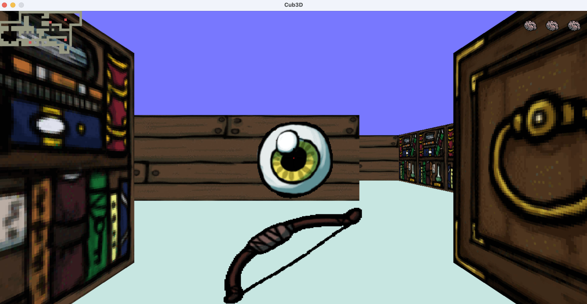

# CUB3D

"My first RayCaster with miniLibX"

## Objective

This project is inspired by the world-famous eponymous 90’s game, which was the first FPS ever.

This project’s objectives are similar to all this first year’s objectives: Rigor, use of C, use of basic algorithms, information research etc.

As a graphic design project, cub3D will enable you to improve skills in these areas: windows, colors, events, fill shapes, etc.

To conclude cub3D is a remarkable playground to explore the playful practical applications of mathematics without having to understand the specifics.

# How to play

### Linux
if you prefer the linux version

`git checkout linux`

### Compilation
`make bonus`
### Execution
`./cub3D game_map/library_game_bonus.cub`

### Rules

To finish the game, the player must traverse through the area to kill all the ennemies.

The player's lives are represented by brains starting at 5, which are diminished when he is shot or attacked by enemies, but he can also gains lives by finding brains. If the player's lives falls to zero, he dies and loses the game.

Weapon : bow and arrows
ennemies : eyes

### keys of the keyboard

`left arrow`, `right arrow` : look left and right
`W`,` A`, `S`, `D` : move
`F` : open doors
`SPACE` : shoot

# Preview

